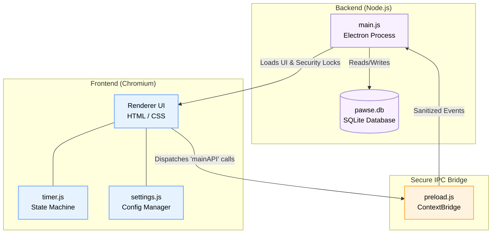

# PAWSE 🐾
*A Secure, Resilient, and Companion-Driven Pomodoro Timer built with Electron.*

   

## 📖 Project Overview
PAWSE is a desktop Pomodoro application engineered to gamify focus and productivity through virtual cat companions. Unlike standard timers, PAWSE was built with **fault tolerance (Local Durable Execution)** and **military-grade Electron security** in mind, proving that even lightweight productivity apps deserve enterprise-level engineering.

---

## 🌟 Key Features (Codebase Implementation)

### 1. Personality-Based Pomodoro Companions
The Pomodoro intervals are dynamically controlled via the `catConfiguration` object initialized in `src/renderer/timer/timer.js`. Users can choose between:
*   👔 **Tux (Tuxedo Cat):** 20-min work, 5-min short break, 20-min long break (`dbId: "tuxedo_cat"`).
*   🍊 **Ginger (Orange Cat):** 15-min work, 3-min short break, 12-min long break (`dbId: "orange_cat"`).
*   🌌 **Void (Black Cat):** 50-min work, 10-min short break, 40-min long break (`dbId: "black_cat"`).

### 2. Adaptive Focus Modes
Implemented using IPC calls to the main process. When a user toggles a view mode, the frontend triggers `window.mainAPI.resize('timer-only')` which is intercepted by `ipcMain.on('resize-window')` inside `src/main/main.js` to physically alter the OS-level window dimensions on the fly.

### 3. Interactive Break-Time Companion & Audio Logic
Audio state is governed by an automated volume engine that monitors `localStorage` states across windows. Ambient purring (`ambientAudio`) loops strictly while the `workingTime` boolean is true. Break transitions seamlessly swap audio channels and unlock the `isPetting` click-listener to reveal random cat facts.

### 4. Local Durable Execution (Fault Tolerance)
PAWSE survives accidental crashes via continuous local state-syncing. As seen in `timer.js`, a `setInterval` writes the exact remaining time, cycle count, and a UNIX `timestamp` to `localStorage` every second. Upon boot, if a `pawseDurableState` payload is detected, the frontend mathematically deducts the offline elapsed seconds and injects the corrected time back into the active UI state, flawlessly resuming operations.

---

## 🏗 Technical Architecture

PAWSE adheres to a strict **Model-View-Controller (MVC)** directory structure, separating the Node.js backend (`src/main/`) from the Chromium frontend (`src/renderer/`). 

### System Architecture Diagram


### System Components in Source Code
*   **Electron Main Process (`src/main/main.js`):** Instantiates the `BrowserWindow`, completely locking down native OS integration, removing window frames, and handling lifecycle hooks.
*   **Renderer Process (`src/renderer/`):** Houses the `index.html`, `settings.html`, and `timer/timer.html` views. Styles are universally governed by a centralized `index.css` root design token system.
*   **Preload Bridge (`src/main/preload.js`):** Acts as the strict IPC gateway. Instead of blindly exposing `ipcRenderer`, it exclusively exposes a highly limited `mainAPI` object for specific tasks (like `savesession` or `minimize`).
*   **Database Engine (`src/main/database.js`):** Handles the raw SQLite3 connection logic. Intercepts session completion events to execute parameterized `INSERT` statements tracking deep analytics per companion.

---

## 🛡️ Security Report (DevSecOps)
Electron applications are notoriously vulnerable if not configured correctly. PAWSE has been aggressively hardened at the architecture level:

1.  **OS-Level Sandboxing (`sandbox: true`):** explicitly defined in the `webPreferences` of `main.js`. The renderer is physically trapped inside an OS-level Chromium sandbox.
2.  **Context Isolation (`contextIsolation: true`):** The frontend has absolute zero access to the backend Node.js APIs or the local file system.
3.  **Content Security Policy (CSP):** Every HTML file enforces `<meta http-equiv="Content-Security-Policy" content="default-src 'self'; script-src 'self'; ...">`. Inline scripts and remote execution are mathematically blocked.
4.  **Navigation Locks (`will-navigate`):** Found in `main.js`, `app.on('web-contents-created')` aggressively monitors new URL requests. External developer links are securely intercepted and piped to the OS's default browser via `require('electron').shell.openExternal(url)`. All other popups are strictly denied (`return { action: 'deny' }`).
5.  **SQL Injection Immunity:** The `database.js` SQLite wrapper exclusively uses Parameterized Queries (e.g. `VALUES (?, ?, ?)`), entirely mitigating injection vulnerabilities.

---

## 🛠 Technology Stack

| Layer | Technology | Codebase Role |
| :--- | :--- | :--- |
| **Frontend UI** | HTML5, CSS3, JS | Controls DOM manipulation, CSS variable themes, and `localStorage` states. |
| **Framework** | Electron | Orchestrates window lifecycles and OS-level operations. |
| **Backend** | Node.js | Provides file system access and IPC handlers (`ipcMain`). |
| **Database** | SQLite3 | Local storage engine auto-generated as `pawse.db`. |
| **IPC Bridge** | `contextBridge` | The sole communication tunnel in `preload.js`. |

---

## 🚀 Setup Instructions

### Prerequisites
*   [Node.js](https://nodejs.org/) (v16.0 or higher recommended)
*   [Git](https://git-scm.com/)

### Installation & Execution
**1. Clone the repository**
```bash
git clone https://github.com/educ-jkescritor/Pawse.git
cd Pawse
```

**2. Install dependencies**
```bash
npm install
```

**3. Start the application**
```bash
npm start
```

---

## 👥 Developers
*   **Jude Keith Escritor** ([GitHub](https://github.com/educ-jkescritor) | [LinkedIn](https://www.linkedin.com/in/jude-keith-escritor-370a69267/))
*   **Jasmin Joyce Obligado** ([GitHub](https://github.com/jjobligado) | [LinkedIn](https://www.linkedin.com/in/jasmin-joyce-obligado/))