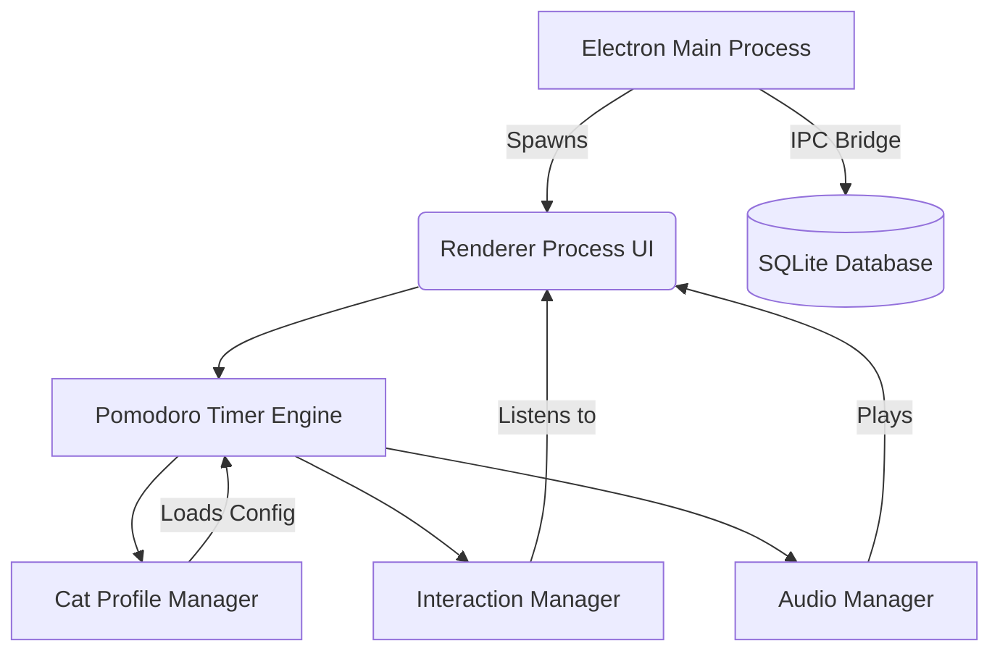

# PAWSE 🐾
*A Secure, Resilient, and Companion-Driven Pomodoro Timer built with Electron.*

   

## 📖 Project Overview
PAWSE is a desktop Pomodoro application engineered to gamify focus and productivity through virtual cat companions. Unlike standard timers, PAWSE was built with **fault tolerance (Local Durable Execution)** and **military-grade Electron security** in mind, proving that even lightweight productivity apps deserve enterprise-level engineering.

---

## 🌟 Key Features

### Personality-Based Pomodoro Companions
Choose from three unique cat companions, each inspired by a familiar cat personality and paired with a tailored productivity style: 
*   👔 **Tux (Tuxedo Cat):** 20-minute work, 5-minute short break, 20-minute long break — a balanced companion for steady productivity.
*   🍊 **Ginger (Orange Cat):** 15-minute work, 3-minute short break, 12-minute long break — energetic and playful, ideal for users who prefer frequent breaks.
*   🌌 **Void (Black Cat):** 50-minute work, 10-minute short break, 40-minute long break — calm and mysterious, designed for deep focus sessions.

### Adaptive Focus Modes
PAWSE offers two minimalist viewing modes to accommodate different work styles:
*   ⏳ **Timer Mode:** Displays only the countdown timer for users who prefer a clean, distraction-free workspace.
*   🐱 **Cat Mode:** Hides the countdown entirely, showing only the animated cat. Users can identify whether they're working or on break through the cat's behavior, helping reduce time anxiety caused by constantly watching the clock.

### Calming Sound Experience 
Instead of harsh buzzer alarms, PAWSE creates a relaxing atmosphere using continuous ambient purring during work sessions. When it's time for a break, the purring fades and is replaced by a gentle meow, providing a softer and less disruptive transition between sessions. 

### Interactive Break-Time Companion 
Cat interactions become available *only* during break sessions, encouraging users to actually step away from work. Clicking or petting the selected cat triggers a unique animation, an adorable meow, and a randomly generated cat fact displayed in a speech bubble, making breaks more rewarding and enjoyable. 

### Local Durable Execution (Fault Tolerance)
Built to survive. The application leverages a continuous `localStorage` state-sync engine. If the app is accidentally closed, crashes, or the computer sleeps, PAWSE calculates the offline elapsed time mathematically and resumes the session exactly where it left off. No cloud orchestration required.

---

## 🛠 Technology Stack

| Layer | Technology |
| :--- | :--- |
| **Frontend** | HTML5, CSS3, JavaScript |
| **Framework** | Electron |
| **Backend/Runtime** | Node.js |
| **Database** | SQLite3 |
| **Package Manager** | npm |
| **Version Control** | Git, GitHub |

---

## 🏗 Technical Architecture

PAWSE adheres to a strict **Model-View-Controller (MVC)** directory structure, separating the Node.js backend from the Chromium frontend. 

### System Architecture Diagram


### System Components
*   **Electron Main Process:** Creates and manages the application window, handles lifecycle events, and enforces strict security protocols (Sandboxing, CSP, Navigation Locks).
*   **Renderer Process (Frontend):** Displays the UI (HTML/CSS/JS). Renders the selected cat, timer, animations, and listens for user interactions (Play/Pause, Skip, Resize, Cat Selection).
*   **Pomodoro Timer Engine:** Maintains the session state (work, short break, long break) and determines the active timer duration based on the selected cat profile.
*   **Cat Profile Manager:** Stores each cat's configuration, personality data, animation mappings, and interaction behaviors.
*   **Interaction Manager:** Enables interactions only during break sessions (petting/click events). Randomly selects and displays cat facts and triggers specific animations.
*   **Audio Manager:** Plays ambient purring during focus sessions, fading into a gentle meow during transitions.

### Application Flow
1.  The user launches PAWSE. Electron loads the renderer process and initializes the user interface.
2.  The user selects a cat companion. The **Cat Profile Manager** loads the corresponding Pomodoro intervals.
3.  Pressing Play starts the **Pomodoro Timer Engine**, which continuously updates the countdown.
4.  When a timer reaches zero, the state changes: the **Audio Manager** switches sounds, the UI updates the cat animation, and the **Interaction Manager** enables/disables petting.
5.  User interactions (Sound On/Off, Skip, Resize, Pet Cat) dynamically generate events that update the global application state.

---

## 🛡️ Security Report (DevSecOps)
PAWSE has been aggressively hardened to score a **0-vulnerability rating** on static security scans (e.g., Aikido Security):

1.  **OS-Level Sandboxing (`sandbox: true`):** The renderer is physically trapped inside an OS-level Chromium sandbox, preventing host system access.
2.  **Strict Context Isolation & Disabled Node Integration:** The frontend operates entirely independently of the backend.
3.  **Content Security Policy (CSP):** Every HTML window enforces a strict meta-tag CSP (`default-src 'self'`).
4.  **Navigation Locks (`will-navigate`):** Authorized developer links (GitHub/LinkedIn) are securely piped to the OS's default web browser using `shell.openExternal`. All internal malicious navigation is blocked.
5.  **Database Injection Immunity:** The `pawse.db` SQLite engine utilizes strict Parameterized Queries.

---

## 🚀 Setup Instructions

### Prerequisites
*   [Node.js](https://nodejs.org/) (v16.0 or higher recommended)
*   [Git](https://git-scm.com/)

### Installation & Execution
**1. Clone the repository**
```bash
git clone https://github.com/educ-jkescritor/Pawse.git
cd Pawse
```

**2. Install dependencies**
```bash
npm install
```

**3. Start the application**
```bash
npm start
```

---

## 👥 Developers
*   **Jude Keith Escritor** ([GitHub](https://github.com/educ-jkescritor) | [LinkedIn](https://www.linkedin.com/in/jude-keith-escritor-370a69267/))
*   **Jasmin Joyce Obligado** ([GitHub](https://github.com/jjobligado) | [LinkedIn](https://www.linkedin.com/in/jasmin-joyce-obligado/))