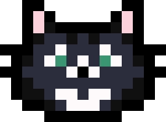
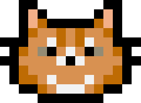
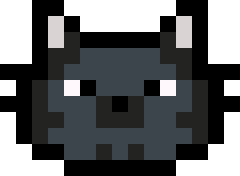
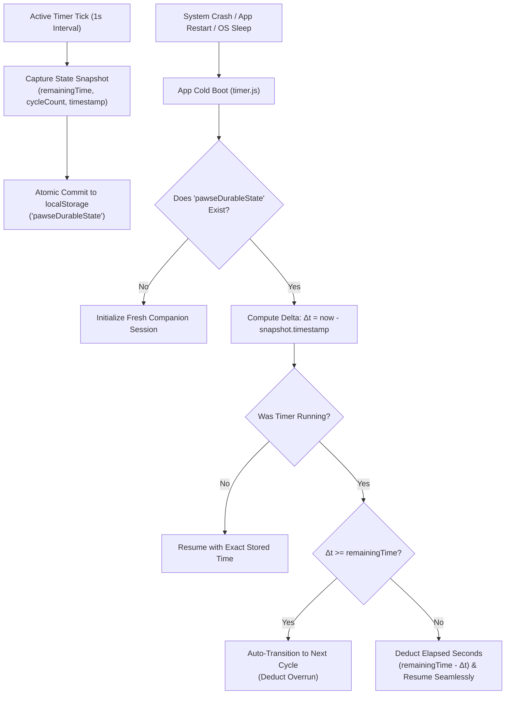
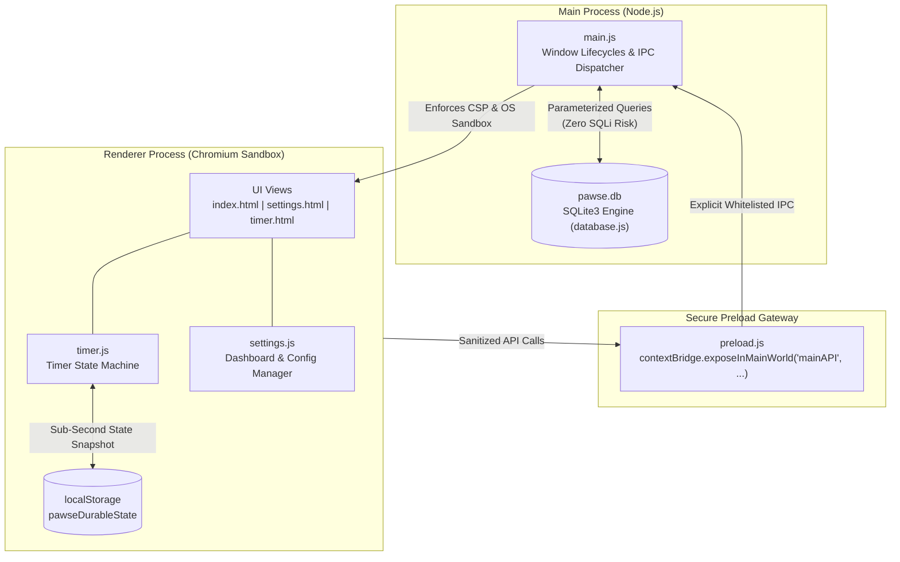

<div align="center">

  

  <p><strong>A Secure, Resilient, and Companion-Driven Pomodoro Desktop Application</strong></p>

  <p>
    <a href="https://github.com/educ-jkescritor/Pawse/releases"></a>
    <a href="https://www.electronjs.org/"></a>
    <a href="https://nodejs.org/"></a>
    <a href="https://www.sqlite.org/"></a>
    <a href="#-devsecops--security-posture"></a>
    <a href="LICENSE"></a>
  </p>

  <p>
    <a href="#-key-features">Key Features</a> •
    <a href="#-meet-your-companions">Meet Your Companions</a> •
    <a href="#-adaptive-window-modes">Window Modes</a> •
    <a href="#-local-durable-execution">Durable Execution</a> •
    <a href="#-technical-architecture">Architecture</a> •
    <a href="#-devsecops--security-posture">Security</a> •
    <a href="#-database-schema--migration-readiness">Database</a> •
    <a href="#-getting-started">Installation</a> •
    <a href="#-team--acknowledgments">Team</a>
  </p>

</div>

---

## 📖 Overview

**PAWSE** is a companion-driven desktop Pomodoro productivity application engineered to turn focused work into an engaging, habit-forming experience through animated pixel-art feline companions. 

Unlike traditional browser or mobile timers that lose progress upon accidental closure or background suspension, PAWSE is architected with **Local Durable Execution** (crash-resilient continuous state tracking) and **enterprise-grade Electron DevSecOps hardening** (OS-level sandboxing, context isolation, strict Content Security Policy, and SQL injection immunity). Built entirely with lightweight Vanilla web standards and CommonJS, PAWSE ensures near-instant startup, zero runtime bloat, and offline-first reliability.

---

## 🌟 Key Features

- **🐾 3 Unique Companion Cadences:** Choose between Tux, Ginger, and Void—each tuned with mathematically balanced work/break cycles, bespoke visual themes, and distinct meow sound effects.
- **🔄 Local Durable Execution:** Continuous sub-second mathematical state synchronization guarantees that if the application or system abruptly closes, reboots, or sleeps, timer state seamlessly recovers with exact elapsed-time deduction.
- **🪟 4 Adaptive Window Modes:** Effortlessly switch between Standard, Settings & Analytics, Minimalist Floating Timer, and Companion Desk-Pet widgets via frameless IPC window transforms.
- **📊 Local Analytics & Lifetime Statistics:** Automatically tracks total focus time, break duration, completed Pomodoro sessions, and companion popularity in a local, zero-leak SQLite database.
- **🐟 Fish-Treat Gamification:** Complete 4 work sessions to earn fish treats for your feline partner and unlock long rejuvenating breaks.
- **🐱 Interactive Break Petting & Feline Trivia:** Click to pet your companion during breaks to hear soothing purrs and uncover delightful cat facts.
- **🎵 Automated Ambient Audio Engine:** Smooth transitions between focused background purring, gentle interval ticking, and alert bells with volume controls.
- **🛡️ DevSecOps-Grade Security:** 100% sandboxed Chromium renderer with zero Node.js process exposure, strict Content Security Policy (CSP), and parameterized SQL operations.

---

## 🐱 Meet Your Companions

Every companion in PAWSE brings their own personality, work cadence, and visual aesthetic:

| Companion | Profile | Cadence (Work / Short / Long) | Target Focus Style | Sound Profile |
| :--- | :---: | :---: | :--- | :--- |
| **Tux**<br>*(Tuxedo Cat)* |  | **20 min** / **5 min** / **20 min** | **Balanced & Methodical**<br>Perfect for general productivity, daily task sprints, and steady pacing. | Crisp bell & balanced meow |
| **Ginger**<br>*(Orange Cat)* |  | **15 min** / **3 min** / **12 min** | **Rapid Sprints**<br>Ideal for quick bursts of deep work, drafting emails, reading, or fighting fatigue. | Energetic, playful meow |
| **Void**<br>*(Black Cat)* |  | **50 min** / **10 min** / **40 min** | **Deep Research & Flow State**<br>Tailored for software development, technical writing, and immersive problem solving. | Deep, resonant chime & meow |

---

## 🪟 Adaptive Window Modes

PAWSE dynamically changes shape to suit your working environment. Toggle views using the custom frameless title bar controls:

```
┌─────────────────────────┐  ┌────────────────────────────────────────────────────────┐
│      Standard Mode      │  │                   Settings & Dashboard                 │
│       (310 x 430)       │  │                       (720 x 430)                      │
│                         │  │                                                        │
│   🐱 Companion Sprite   │  │   📊 Overall Focus Time & Session Stats                │
│   ⏱️ Digital Timer Display│  │   🐱 Companion Preferences & Audio Volumes             │
│   ▶️ Play / Skip / Options │  │   ⚙️ Account & Application Controls                     │
└─────────────────────────┘  └────────────────────────────────────────────────────────┘

        ┌─────────────────────────┐         ┌─────────────────────────┐
        │    Timer-Only Widget    │         │     Cat-Only Widget     │
        │       (240 x 100)       │         │       (240 x 240)       │
        │   ⏱️ 24:58 [▶][⏭][⚙]    │         │   🐱 Companion Desk Pet  │
        └─────────────────────────┘         └─────────────────────────┘
```

1. **Standard Mode (310 x 430):** The primary view displaying the full companion sprite animation, digital countdown display, fish reward tracker, and controls.
2. **Settings & Analytics Dashboard (720 x 430):** An independent management dashboard displaying overall work hours, break minutes, completed cycles, audio sliders, and companion picker.
3. **Timer-Only HUD (240 x 100):** A compact floating widget that tucks neatly into the corner of your workspace for uninterrupted multitasking.
4. **Cat-Only Desk Pet (240 x 240):** Turns your companion into an animated pixel desk pet to keep you company during study and relaxation.

---

## 🔄 Local Durable Execution

A core engineering highlight of PAWSE is its crash-proof timer architecture. Traditional web-based timers freeze or reset if the tab suspends or the window is closed. PAWSE implements **Local Durable Execution**:


```mermaid
flowchart TD
    A["Active Timer Tick (1s Interval)"] --> B["Capture State Snapshot<br/>(remainingTime, cycleCount, timestamp)"]
    B --> C["Atomic Commit to localStorage<br/>('pawseDurableState')"]
    
    D["System Crash / App Restart / OS Sleep"] --> E["App Cold Boot (timer.js)"]
    E --> F{"Does 'pawseDurableState'<br/>Exist?"}
    F -- No --> G["Initialize Fresh Companion Session"]
    F -- Yes --> H["Compute Delta: Δt = now - snapshot.timestamp"]
    H --> I{"Was Timer Running?"}
    I -- No --> J["Resume with Exact Stored Time"]
    I -- Yes --> K{"Δt >= remainingTime?"}
    K -- Yes --> L["Auto-Transition to Next Cycle<br/>(Deduct Overrun)"]
    K -- No --> M["Deduct Elapsed Seconds<br/>(remainingTime - Δt) & Resume Seamlessly"]
```

### The Recovery Algorithm
1. Every second, `src/renderer/timer/timer.js` writes the current companion mode, cycle state, remaining seconds, and high-resolution UNIX `timestamp` to `localStorage`.
2. Upon startup, `timer.js` evaluates whether an active session snapshot exists.
3. If detected, it calculates offline elapsed time:
   $$\Delta t = \lfloor t_{\text{current}} - t_{\text{snapshot}} \rfloor$$
4. If $\Delta t < t_{\text{remaining}}$, the clock automatically syncs forward to the exact second without user intervention.
5. If $\Delta t \ge t_{\text{remaining}}$, PAWSE triggers cycle transition logic, awards session completion, and begins the next appropriate interval cleanly.

---

## 🏗 Technical Architecture

PAWSE enforces a strict **Model-View-Controller (MVC)** and **Multi-Process Architecture**, ensuring that untrusted renderer code can never access operating system primitives directly.

### System Architecture Diagram


```mermaid
flowchart TD
    subgraph Backend ["Main Process (Node.js)"]
        A["main.js<br/>Window Lifecycles & IPC Dispatcher"]
        C[("pawse.db<br/>SQLite3 Engine (database.js)")]
        A <-->|"Parameterized Queries<br/>(Zero SQLi Risk)"| C
    end

    subgraph Bridge ["Secure Preload Gateway"]
        D["preload.js<br/>contextBridge.exposeInMainWorld('mainAPI', ...)"]
    end

    subgraph Frontend ["Renderer Process (Chromium Sandbox)"]
        UI["UI Views<br/>index.html | settings.html | timer.html"]
        TM["timer.js<br/>Timer State Machine"]
        SM["settings.js<br/>Dashboard & Config Manager"]
        DS[("localStorage<br/>pawseDurableState")]
        UI --- TM
        UI --- SM
        TM <-->|"Sub-Second State Snapshot"| DS
    end

    A -->|"Enforces CSP & OS Sandbox"| UI
    Frontend -->|"Sanitized API Calls"| D
    D -->|"Explicit Whitelisted IPC"| A
```

### File Structure & Module Responsibilities

```
pawse/
├── src/
│   ├── assets/               # Pixel-art sprites, avatars, icons, fonts, and sound effects
│   │   ├── fonts/            # Inter & Pixelify Sans TrueType fonts
│   │   ├── icons/            # Action and UI navigation icons
│   │   ├── logos/            # Application logos and brand assets
│   │   ├── photos/           # High-resolution companion avatar portraits
│   │   ├── sounds/           # Purrs, meows, ticking, and alarm audio assets
│   │   └── sprites/          # Multi-frame animated cat sprites (static, work, click)
│   ├── main/                 # Electron Main Process (Node.js runtime)
│   │   ├── database.js       # SQLite3 connection, automated schema migrations, parameterized queries
│   │   ├── main.js           # Window lifecycle, frameless controls, focus management, IPC routing
│   │   └── preload.js        # Isolated contextBridge exposing safe window.mainAPI
│   └── renderer/             # Chromium Presentation Layer (Vanilla HTML5 / CSS3 / JS)
│       ├── index.css         # Central design token system (CSS variables, themes, typography)
│       ├── index.html        # Companion selection welcome screen
│       ├── index.js          # Selection UI logic and companion switching
│       ├── settings.html     # Settings modal & productivity analytics view
│       ├── settings.js       # Analytics aggregation, audio volume engine, theme updates
│       └── timer/            # Core Pomodoro execution environment
│           ├── timer.css     # Timer-specific HUD and widget styles
│           ├── timer.html    # Timer view markup
│           └── timer.js      # Pomodoro state machine & local durable execution logic
├── config.js                 # Global application configuration
├── package.json              # Dependencies, build metadata, and npm scripts
└── README.md                 # Project documentation
```

---

## 🛡️ DevSecOps & Security Posture

PAWSE enforces a zero-trust, defence-in-depth architecture across all Electron components:

| Security Vector | Implementation Mechanism | Purpose & Verification |
| :--- | :--- | :--- |
| **OS-Level Sandboxing** | `sandbox: true` in `BrowserWindow.webPreferences` | Traps Chromium renderer threads in the OS kernel sandbox. |
| **Process Isolation** | `contextIsolation: true`, `nodeIntegration: false` | Prevents malicious DOM injections from accessing Node `require()`, `process`, or `fs`. |
| **Strict CSP** | `<meta http-equiv="Content-Security-Policy">` on all pages | Prohibits `'unsafe-eval'`, external scripts, unauthorized styles, and remote data leaks. |
| **Safe Navigation** | `contents.setWindowOpenHandler` & `will-navigate` in `main.js` | External links (GitHub, LinkedIn) open in OS default browser; all internal popups denied. |
| **SQL Injection Immunity** | Parameterized statements (`VALUES (?, ?, ?)`) in `database.js` | Completely neutralizes SQL injection attacks across all database operations. |
| **IPC Sanitization** | Explicit, strictly typed methods on `window.mainAPI` | Whitelists only safe IPC actions; no raw `ipcRenderer` access is ever leaked to the DOM. |

---

## 💾 Database Schema & Migration Readiness

PAWSE uses a local SQLite3 database (`pawse.db`) created automatically in the user data directory. To ensure 100% forward-compatibility with future releases (such as cloud synchronization via Supabase), the database incorporates an **automated zero-downtime migration engine**:

```sql
CREATE TABLE IF NOT EXISTS session (
  id INTEGER PRIMARY KEY AUTOINCREMENT,
  email TEXT DEFAULT 'guest',
  cat_type TEXT,
  total_work_seconds INTEGER,
  total_break_seconds INTEGER,
  total_work INTEGER,
  total_break INTEGER,
  total_pomodoro INTEGER,
  date_completed TEXT,
  is_synced INTEGER DEFAULT 0,
  uuid TEXT UNIQUE
);
```

- **Cloud Isolation:** In guest mode, `email` defaults to `'guest'` and sync flags remain strictly local.
- **Deduplication:** Every completed session is stamped with a cryptographically secure UUID (`crypto.randomUUID()`) to prevent duplicate records during migrations.
- **Self-Healing Schema:** On boot, `database.js` queries table `PRAGMA table_info(session)` and automatically executes `ALTER TABLE` to backfill any missing columns and populate UUIDs for legacy rows.

---

## 🛠 Technology Stack

- **Runtime & Desktop Framework:** [Electron](https://www.electronjs.org/) (v42.4.0)
- **Engine / Backend:** [Node.js](https://nodejs.org/) (CommonJS module architecture)
- **Local Persistence:** [SQLite3](https://www.sqlite.org/) (v6.0.1)
- **Frontend Architecture:** Pure Vanilla HTML5, CSS3, JavaScript (No heavy frameworks; zero bundle overhead)
- **Typography:** Pixelify Sans (digital displays, headers) & Inter (UI typography, dashboards)
- **Packaging & Distribution:** [electron-builder](https://www.electron.build/) (NSIS installer for Windows)

---

## 🚀 Getting Started

### Prerequisites

- [Node.js](https://nodejs.org/) (Version 16.x, 18.x, or 20.x recommended)
- [npm](https://www.npmjs.com/) (bundled with Node.js)
- [Git](https://git-scm.com/)

### Installation

1. **Clone the repository:**
   ```bash
   git clone https://github.com/educ-jkescritor/Pawse.git
   cd Pawse
   ```

2. **Install dependencies:**
   ```bash
   npm install
   ```

3. **Launch the application in development mode:**
   ```bash
   npm start
   ```

### Building the Distributable (Windows NSIS)

To package PAWSE into a standalone Windows installer executable (`.exe`):

```bash
npm run build
```

The compiled installer and unpackaged binaries will be located inside the `dist/` directory.

---

## 👥 Team & Acknowledgments

**PAWSE** was created and engineered with ❤️ by:

- **Jude Keith Escritor** — [GitHub](https://github.com/educ-jkescritor) • [LinkedIn](https://www.linkedin.com/in/jude-keith-escritor-370a69267/)
- **Jasmin Joyce Obligado** — [GitHub](https://github.com/jjobligado) • [LinkedIn](https://www.linkedin.com/in/jasmin-joyce-obligado/)

### Special Thanks
- Pixel art sprites and audio curated for focus and companion gaming.
- The open-source Electron, Node.js, and SQLite communities.

---

## 📄 License

This project is licensed under the [MIT License](LICENSE) — feel free to use, modify, and distribute as described in the license.